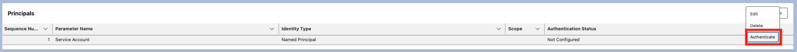

# Salesforce ↔ ServiceNow Integration

## Introduction

This integration demonstrates how to connect Salesforce with ServiceNow using the latest Salesforce features such as **External Authentication Providers**, **Named Credentials**, and **External Credentials**. By leveraging Salesforce’s native **OAuth 2.0 browser flow** and **PKCE (Proof Key for Code Exchange)**, we securely authenticate with ServiceNow without storing sensitive credentials in Apex code.  
The configuration enables seamless token management handled entirely by Salesforce, ensuring compliance with security best practices. Once set up, Salesforce can automatically create ServiceNow **Incidents (INC)** whenever a **Case** is logged, providing real-time synchronization between the two systems.  

This approach simplifies integration, reduces maintenance overhead, and improves scalability by using **declarative authentication and credential management** features instead of custom implementations.  

## Use Case

Whenever a **Case** is created in Salesforce, a corresponding **Incident (INC)** should be created in ServiceNow.

---

## Step 1: Sign Up and Create an OAuth Application in ServiceNow

1. **Create a ServiceNow instance**  
   - Go to [Developer Edition Sing-up](https://signon.servicenow.com/x_snc_sso_auth.do?pageId=sign-up) and request a **Developer Instance**.  
   - Note down the ***username and password*** for the instance.

2. **Launch the instance** by clicking on **Start Building**.  
   - Under the “***All***” tab, search & select ***System OAuth > Application Registry*** and click on **New**.  

   

3. Select **Create an OAuth API endpoint for external clients**.  

   

4. Provide the following details and click on **Submit**:  
   - **Name**  
   - Check **Public Client**  
   - Keep **Redirect URL** blank for now  

   

5. Once submitted, note down the **Client Id** and **Client Secret**.

---

## Step 2: Create External Auth Identity Provider in Salesforce

1. **Login to Salesforce** and go to:  
   ***Setup > Named Credentials > External Auth Identity Providers***

2. Click **New** and provide the following details:  
   1. Label & Name of your choice  
   2. Authentication protocol → ***OAuth 2.0***  
   3. Authentication Flow Type → ***Authorization Code (Browser Flow)***  
   4. Client Id & Client Secret (from ServiceNow)  
   5. Authorize Endpoint URL → ***https://<your_instance_name>.service-now.com/oauth_auth.do***  
   6. Token Endpoint URL → ***https://<your_instance_name>.service-now.com/oauth_token.do***  
   7. Use Proof Key for Code Exchange (PKCE) Extension → ***Checked***

   

3. After saving, a **Callback URL** will be generated in the External Auth Identity Provider.  
   - Copy this URL and update it in the **ServiceNow OAuth application's Redirect URL**.

---

## Step 3: Create External Credentials in Salesforce

1. Go to:  
   ***Setup > Named Credentials > External Credentials***

2. Click **New** and provide the following details:  
   1. Label & Name of your choice  
   2. Authentication Protocol → ***OAuth 2.0***  
   3. Authentication Flow Type → ***Browser Flow***  
   4. Identity Provider → ***Select the External Auth Identity Provider created in the previous step***

   

3. Under **External Credential > Principals**, click **New** with the following details:  
   1. Name of your choice  
   2. Identity Type → ***Named Principal***  

   

4. Provide access to the principal via a **Permission Set** or **Profile**.

5. Click the **Action drop-down** of the Principal and select **Authenticate**.  

   

6. A new window will prompt for **Username & Password**. Enter the instance credentials and click **Log in**.  

   

7. Click **Allow** access for the ServiceNow OAuth App.  

   

8. Confirm the **External Access**.  

   

9. You will be redirected to Salesforce with Principal **Authentication Status** as **Configured**.  

   

---

## Step 4: Create Named Credentials in Salesforce

1. Go to:  
   ***Setup > Named Credentials***

2. Click **New** and provide the following details:
    1. Label & Name of your choice
    2. URL → https://<your_instance_name>.service-now.com/api
    3. External Credential → Select the one created in previous step

    

## Refer to the code

Sample code is written to demonstrate creation of an incident in ServiceNow upon a Case creation in Salesforce

[The sample code](./force-app/main/default)
